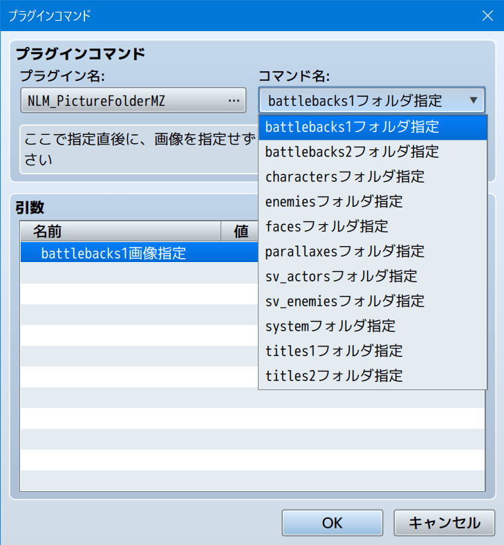

# ピクチャのフォルダ指定プラグイン（NLM_PictureFolderMZ.js）
### RPGツクールMZ専用プラグイン

「ピクチャの表示」で、picturesフォルダ以外のフォルダを指定できます

### 次の手順で使用してください
1. プラグインコマンドで「NLM_PictureFolderMZ」を呼び出す
2. 「コマンド名」で使いたい画像の「フォルダ」を指定
3. 「引数」で使いたい画像の「ファイル名」などを選択
4. 「OK」を押す
5. 画像を指定せずに「ピクチャの表示」を実行

### 補足
- デフォルト画像のみ利用のサンプルプロジェクト用に開発
- 他フォルダの画像をpicturesフォルダへも複製すればよいだけの話なんですが、無駄な画像ファイル容量を節減できる利点があります
- characters, faces, sv_actors, systemフォルダでは画像の一要素だけを選択して表示できる機能を付けてあります

# download

プラグインの download は、[右クリック「名前を付けてリンク先を保存」](https://raw.githubusercontent.com/nolimits-tukool/NLM_PictureFolderMZ/refs/heads/main/NLM_PictureFolderMZ.js)  
RPGツクールMZ専用です

# license

　MITライセンスの通りです

## [リポジトリ 一覧へ](https://github.com/nolimits-tukool?tab=repositories)
